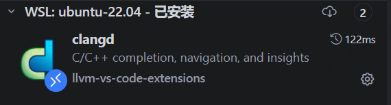
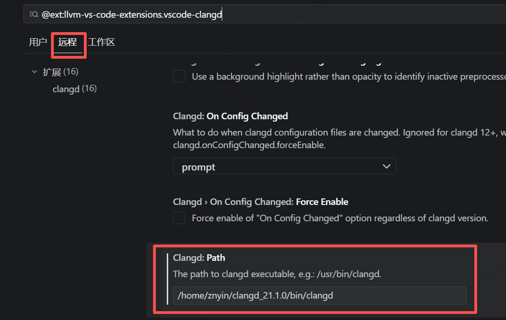

## 背景与动机

- Onix 目前通过传统 BIOS 启动（自研 bootloader 或 GRUB ISO），根文件系统只能从 IDE 磁盘挂载。不支持 USB，因此无法在实体机上从 U 盘运行系统。
- 目标平台（Intel Core i5-5200U、USB 3.0 口引导）需要 UEFI + GPT + xHCI，以便在 GRUB 加载内核后，从同一块 U 盘上的可写 Minix 根分区挂载并运行完整系统。

## 变更内容

- 新增构建目标，产出可用 `dd` 写入 U 盘的 GPT UEFI 磁盘镜像：FAT32 ESP（GRUB + 内核）+ Minix 根分区
- 实现 xHCI 主机控制器驱动，支持 Intel USB 3.0（目标硬件上的主要引导路径）
- 实现 USB Mass Storage 类（Bulk-Only Transport），并注册 USB 块设备
- 为 USB 块设备实现 GPT 分区解析（现有 `ide_part_init` 仅支持 MBR，会误读 GPT 磁盘上的保护性 MBR）
- 调整根挂载逻辑：在纯 USB 单盘配置下，从 USB GPT 第二分区挂载 Minix 根文件系统

## 具体任务

### 配置 clangd 以支持源码中函数定义的导航跳转

1. wsl中安装clangd工具，下载地址：https://github.com/clangd/clangd/releases，下载clangd-linux-21.1.0.zip文件后，解压到指定目录下。
2. wsl中安装bear，Bear 通过拦截编译过程生成 compile_commands.json 编译数据库，为 clangd 等工具提供准确的编译参数，从而支持代码跳转、补全和静态分析。
    ``` bash
    sudo apt update
    sudo apt install bear

    bear --version # 可正常输出版本号，说明安装成功
    ```
3. windows中vscode系的ide中，在远程wsl中安装clangd插件
    
4. 配置clangd插件，设置clangd工具绝对路径
    
5. 禁用C/C++ extension有代码跳转功能的相关插件，否则与clangd可能有冲突
6. 清理并重新构建，生成compile_commands.json
    ``` bash
    make clean
    bear -- make qemu
    ```
7. 重新打开ide，打开c源码文件，clangd会开始生成索引，函数定义的导航跳转也生效了

### 新增构建目标，产出可用 `dd` 写入 U 盘的 GPT UEFI 磁盘镜像：FAT32 ESP（GRUB + 内核）+ Minix 根分区