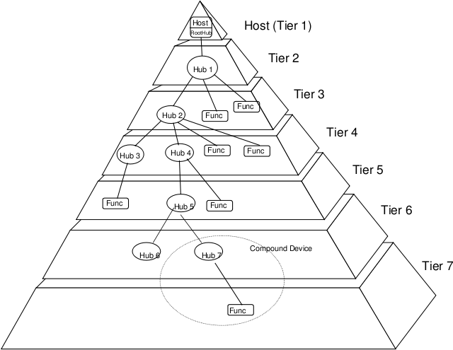
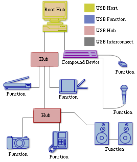

# 一些准备

1. 日志按级别打印，灵活控制日志输出
2. 新增USBLOG函数，便于将 USB 引导期里程碑日志在 USB 启动构建下直接走 printk（经帧缓冲上屏，不受 ONIX_LOG_LEVEL 裁剪，便于实体机无串口时定位失败阶段）
3. memory_init 兼容UEFI mmap

# USB硬件拓扑图

要理解几个概念：
1. USB主机控制器：主机侧负责发起和管理USB传输、枚举设备并连接CPU与USB总线的硬件控制器。举例：主板芯片组里的 xHCI 控制器、PCIe 转 USB 扩展卡上的 USB 控制器。
2. USB hub：把一个上游USB端口扩展成多个下游端口，并负责信号中继、端口管理和设备枚举的集线器。
3. USB功能设备：连接在USB总线上、通过端点提供具体功能的终端外设，由主机控制器调度通信。举例：U盘、鼠标、键盘、打印机、USB摄像头、USB声卡。

USB主机控制器 → USB Hub → USB功能设备，共同构成USB树形拓扑。

4. USB端点：USB功能设备内部可被主机独立寻址的逻辑通信通道/数据缓冲区，是主机与设备之间数据传输的起点或终点，具有方向（IN/OUT）、传输类型（控制/中断/批量/等时）和最大包长等属性。举例：USB鼠标通常有一个中断IN端点，用于把移动和按键数据上报给主机；U盘通常有批量IN端点和批量OUT端点，分别用于读数据和写数据；所有USB设备的端点0都是默认控制端点，用于枚举和标准请求。端点是设备侧概念；主机侧通过“管道”与端点通信。关系可记为：主机控制器 → Hub → 功能设备 → 端点。

# 驱动实现

1. 找到xHCI controller
2. 初始化xHCI主机控制器全局状态（MMIO 基址、Ring、设备上下文），找到xHCI的slots、ports、ctx、scratch
    - MMIO（Memory-Mapped I/O，内存映射 I/O）：把设备寄存器或设备内存映射到 CPU 的物理地址空间，CPU 用普通的访存指令（load/store）读写这些地址，就相当于在访问设备，而不是访问真正的 RAM。
    - membase：xHCI 控制器寄存器的 MMIO 基地址，驱动通过 membase 访问 xHCI Capability Registers
    - max_slots：有多少设备槽位；
    - max_ports：有多少根端口；
    - ctx_size：上下文结构多大；
    - max_scratchpad：需要多少临时缓冲区。
    - 设备槽位与根端口的区别与联系：根端口是 xHCI 根 Hub 上的物理/逻辑端口，是设备接入 USB 拓扑的“入口”；设备槽位是 xHCI 内部为每个被枚举的 USB 设备分配的“管理句柄/资源位”，用来存放该设备的上下文和传输信息。二者不是一一对应关系。根端口是“门”：设备从哪个门进来。设备槽位是“座位”：每个进来的设备都要分配一个座位来管理。一个门可以带很多座位：通过 Hub 级联，一个根端口可以对应多个设备槽位。
3. 实体机必须先从固件接管控制器，再做端口路由，最后才复位/运行
    - Command Ring：驱动写 TRB，硬件读，管理命令（Enable Slot 等）
    - Event Ring：硬件写 TRB，驱动读，命令/传输完成通知
    - TRB：Transfer Request Block
    - Ring 是驱动和 xHCI 控制器共用的一块环形 TRB 队列。TRB是这条队列里的工作单元，固定 16 字节，驱动和控制器不靠中断传命令本身，而是把 TRB 放进对方能 DMA 读写的内存，再用门铃寄存器喊一声“有新活”。
    - DMA：DMA（Direct Memory Access，直接内存访问）：让外设（这里是 xHCI 控制器）不经过 CPU 逐字节搬运，直接读写系统内存的一种机制。在 xHCI 里，Command Ring、Event Ring、TRB、数据缓冲区都在内存中，xHCI 控制器通过 DMA 自己去读命令、写事件、搬数据，CPU 只负责准备内存、按门铃和收中断。
    - Doorbell（门铃）机制：xHCI 中驱动通知控制器“有新任务”的寄存器写操作。驱动把 TRB 放进 Ring 后，不是等控制器轮询，而是写对应的 Doorbell 寄存器“按一下门铃”，控制器收到后就会通过 DMA 去读 Ring，取走并执行新的 TRB。