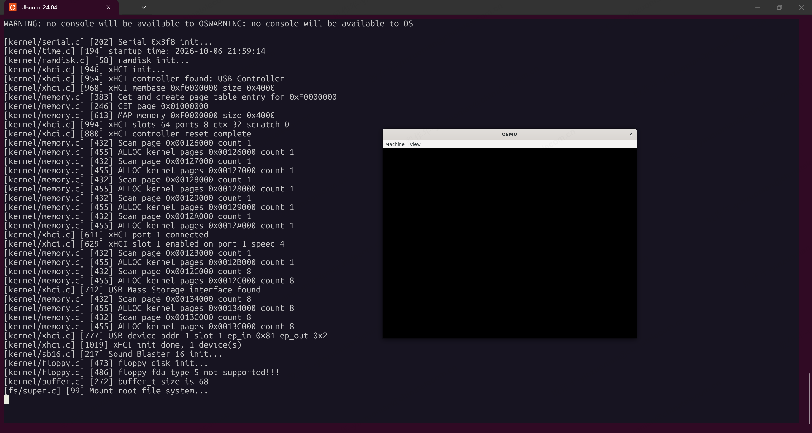

# 一些准备

1. 日志按级别打印，灵活控制日志输出
2. memory_init 兼容UEFI mmap
    - 先前实现按「最长 AVAILABLE」选型，UEFI 内存图中最大块从 9MiB 起，与 Onix「可用物理内存从 1MiB 起」的模型冲突。
    - Multiboot2 路径下改为：固定 `memory_base = MEMORY_BASE`（1MiB），用 mmap 中 AVAILABLE 区域的最高结尾地址推导 `memory_size`
    - 在建立物理页占用表时，将管理范围内非 AVAILABLE（及未被 AVAILABLE 覆盖）的页标记为已占用，避免把 NVS/RESERVED 洞当作可分配内存
    - 保持现有 `total_pages` / `start_page` / `memory_map` 放在 1MiB 的模型与 assert；不改为「沿用 base=9MiB」

# USB硬件拓扑图


要理解几个概念：
1. USB主机控制器：主机侧负责发起和管理USB传输、枚举设备并连接CPU与USB总线的硬件控制器。举例：主板芯片组里的 xHCI 控制器、PCIe 转 USB 扩展卡上的 USB 控制器。
2. USB hub：把一个上游USB端口扩展成多个下游端口，并负责信号中继、端口管理和设备枚举的集线器。
3. USB功能设备：连接在USB总线上、通过端点提供具体功能的终端外设，由主机控制器调度通信。举例：U盘、鼠标、键盘、打印机、USB摄像头、USB声卡。

USB主机控制器 → USB Hub → USB功能设备，共同构成USB树形拓扑。

4. USB端点：USB功能设备内部可被主机独立寻址的逻辑通信通道/数据缓冲区，是主机与设备之间数据传输的起点或终点，具有方向（IN/OUT）、传输类型（控制/中断/批量/等时）和最大包长等属性。举例：USB鼠标通常有一个中断IN端点，用于把移动和按键数据上报给主机；U盘通常有批量IN端点和批量OUT端点，分别用于读数据和写数据；所有USB设备的端点0都是默认控制端点，用于枚举和标准请求。端点是设备侧概念；主机侧通过“管道”与端点通信。关系可记为：主机控制器 → Hub → 功能设备 → 端点。

# 驱动实现

1. 找到xHCI controller
2. 初始化xHCI主机控制器全局状态（MMIO 基址、Ring、设备上下文），找到xHCI的slots、ports、ctx、scratch
    - MMIO（Memory-Mapped I/O，内存映射 I/O）：把设备寄存器或设备内存映射到 CPU 的物理地址空间，CPU 用普通的访存指令（load/store）读写这些地址，就相当于在访问设备，而不是访问真正的 RAM。
    - membase：xHCI 控制器寄存器的 MMIO 基地址，驱动通过 membase 访问 xHCI Capability Registers
    - max_slots：有多少设备槽位；
    - max_ports：有多少根端口；
    - ctx_size：上下文结构多大；
    - max_scratchpad：需要多少临时缓冲区。
    - 设备槽位与根端口的区别与联系：根端口是 xHCI 根 Hub 上的物理/逻辑端口，是设备接入 USB 拓扑的“入口”；设备槽位是 xHCI 内部为每个被枚举的 USB 设备分配的“管理句柄/资源位”，用来存放该设备的上下文和传输信息。二者不是一一对应关系。根端口是“门”：设备从哪个门进来。设备槽位是“座位”：每个进来的设备都要分配一个座位来管理。一个门可以带很多座位：通过 Hub 级联，一个根端口可以对应多个设备槽位。
3. 实体机必须先从固件接管控制器，再做端口路由，最后才复位/运行
    - Command Ring：驱动写 TRB，硬件读，管理命令（Enable Slot 等）
    - Event Ring：硬件写 TRB，驱动读，命令/传输完成通知
    - TRB：Transfer Request Block
    - Ring 是驱动和 xHCI 控制器共用的一块环形 TRB 队列。TRB是这条队列里的工作单元，固定 16 字节，驱动和控制器不靠中断传命令本身，而是把 TRB 放进对方能 DMA 读写的内存，再用门铃寄存器喊一声“有新活”。
    - DMA：DMA（Direct Memory Access，直接内存访问）：让外设（这里是 xHCI 控制器）不经过 CPU 逐字节搬运，直接读写系统内存的一种机制。在 xHCI 里，Command Ring、Event Ring、TRB、数据缓冲区都在内存中，xHCI 控制器通过 DMA 自己去读命令、写事件、搬数据，CPU 只负责准备内存、按门铃和收中断。
    - Doorbell（门铃）机制：xHCI 中驱动通知控制器“有新任务”的寄存器写操作。驱动把 TRB 放进 Ring 后，不是等控制器轮询，而是写对应的 Doorbell 寄存器“按一下门铃”，控制器收到后就会通过 DMA 去读 Ring，取走并执行新的 TRB。
4. 枚举USB设备
    过程如下：
    ``` txt
    1. 端口上电
    2. xhci_port_reset
    3. xhci_cmd_enable_slot
    4. 为hc->dev_ctx[slot]分配内存：hc->dev_ctx[slot] 是某个槽位的 Device Context（输出上下文）。Enable Slot 成功后，驱动为这个槽位分配一页并清零，之后由控制器读写。它按 ctx_size（32 或 64 字节）排成一段：第 0 段是 Slot Context：速率、根端口号、已启用的上下文个数、USB 地址、槽位状态。后面每段是一个 Endpoint Context：端点类型、最大包长、Transfer Ring 的出队指针。控制器发传输时读的是这份档案，不会直接看驱动临时填的申请内容。
    5. 对hc->dcbaap[slot]进行赋值：下标（1..max_slots）存放该槽位dev_ctx的物理地址
    6. xhci_init_ep_ring(hc, slot, 1)：为刚启用的槽位分配默认控制端点（端点 0）的 Transfer Ring。
    7. 为hc->input_ctx填写内容：hc->input_ctx 是 Input Context，只给 Address Device 和 Configure Endpoint 用。命令 TRB 的地址字段指向它的物理地址，控制器读完就按其中的标志，把选中的 Slot / Endpoint Context 合并进对应的 dev_ctx。
    8. xhci_cmd_address_device：向 xHCI 控制器发出 Address Device 命令，让端口上刚启用的设备从“已占槽位”进入“已分配 USB 地址”，之后驱动才能用端点 0 做控制传输。
    9. 获取usb_device_desc_t、usb_config_desc_t、usb_interface_desc_t、usb_endpoint_desc_t，并初始化xhci_device_t
    10. xhci_init_ep_ring(hc, slot, ep_in_id)：为设备的输入端点初始化Transfer Ring
    11. xhci_init_ep_ring(hc, slot, ep_out_id)：为设备的输出端点初始化Transfer Ring
    12. xhci_cmd_configure_ep：向 xHCI 控制器发出 Configure Endpoint 命令，把刚准备好的批量 IN/OUT 端点写进该槽位的设备上下文。
    13. xhci_set_configuration：通过端点 0 向 USB 设备发出标准请求 SET_CONFIGURATION，让设备启用配置描述符里的那套配置。
    ```

    **input_ctx、dcbaap、dev_ctx三者如何协同工作**
    ``` txt
    驱动填写 input_ctx
            |
            | Address Device / Configure Endpoint
            | （TRB 指向 input_ctx 的物理地址）
            v
    控制器用槽位号查 dcbaap[slot]
            |
            v
    把选中的上下文写入 dev_ctx[slot]
            |
            v
    之后的传输按 dev_ctx 里的端点上下文去跑 Transfer Ring
    ```

    **usb_device_desc、usb_config_desc、usb_interface_desc、usb_endpoint_desc四种描述符**

    这四种描述符是 USB 设备自己上报的嵌套说明，从整机到单条传输通道逐层变细。设备描述符单独读取；配置、接口、端点三种则连在同一块配置描述符缓冲区里，驱动按每段开头的长度和类型往下拆。

    ``` txt
    usb_device_desc_t          一台设备
        └── usb_config_desc_t    一种工作配置（可有多个，枚举时启用其中一个）
                └── usb_interface_desc_t   配置里的一项功能
                    └── usb_endpoint_desc_t   这项功能使用的一条端点
    ```

    - 设备描述符描述整台设备：USB 版本、厂商号、产品号、端点 0 最大包长，以及有几套配置（num_configs）。驱动先读前 8 字节，用其中的 max_packet 校正 ep0_mps。它不包含接口和端点的细节。
    - 配置描述符描述一套可被 SET_CONFIGURATION 启用的配置。config_value 就是后来写入 SET_CONFIGURATION 的值，num_interfaces 是这套配置包含的接口数，total_len 是整块缓冲区的长度。驱动先读 9 字节拿到 total_len，再把配置、接口、端点一次读回来。
    - 接口描述符描述配置中的一项功能。class、subclass、protocol 说明这项功能是什么，endpoints 说明它带几个端点。驱动用这三个字段识别 Bulk-Only 大容量存储：类 0x08、子类 0x06、协议 0x50。
    - 端点描述符描述接口下的一条传输通道（端点 0 不出现在这里）。addr 是端点号加方向位，attr 的低 2 位是传输类型（批量是 2），max_packet 是最大包长。驱动从中取出批量 IN/OUT，填进 xhci_device_t 的 ep_in、ep_out 和对应的最大包长，供后面建 Transfer Ring 和发批量传输。

# 结果展示

执行`make qemu-usb-xhci`，使用qemu模拟`xhci与usb-storage`，应看到如下图的串口日志输出



源码位置：https://github.com/znyinyyniu/onix/tree/usb-explain