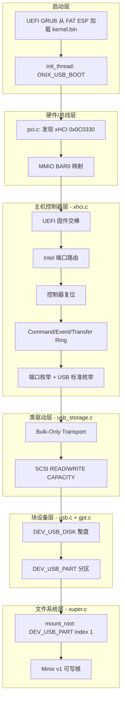

# Onix U 盘驱动实现架构分析

Onix 的 U 盘支持是为 **UEFI + GPT + USB 3.0 引导** 场景设计的，采用经典的分层驱动模型。整体由 **PCI 发现 → xHCI 主机控制器 → Mass Storage 类驱动 → 块设备/GPT → 文件系统挂载** 五层组成。

---

## 总体架构



---

## 1. 编译开关与初始化顺序

USB 启动通过 `ONIX_USB_BOOT` 宏与 IDE 路径隔离。在 `init_thread()` 中，USB 路径跳过 `ide_init()` / `e1000_init()`，改为：

```c
#ifdef ONIX_USB_BOOT
    xhci_init();
    usb_storage_init();
#else
    ide_init(); // 初始化 IDE 设备
#endif
```

初始化链路：

| 顺序 | 函数 | 职责 |
|------|------|------|
| 1 | `xhci_init()` | PCI 发现、控制器初始化、USB 枚举 |
| 2 | `usb_storage_init()` | 绑定 Mass Storage 设备、读容量、解析 GPT、注册块设备 |
| 3 | `super_init()` → `mount_root()` | 挂载 USB 分区 2（Minix 根） |

---

## 2. xHCI 主机控制器驱动（底层）

**文件：** `src/kernel/xhci.c`、`src/include/onix/xhci.h`

这是整个 USB 栈的核心，从零实现了 xHCI 规范的关键子集。

### 2.1 控制器发现与映射

- 通过 `pci_find_device_by_class(PCI_CLASS_SERIAL_USB_XHCI)` 查找类码 `0x0C0330`
- 映射 BAR0 MMIO，解析 Capability / Operational / Runtime / Doorbell 寄存器区域

### 2.2 实体机特有的关键步骤

设计文档和代码都强调了两步 **QEMU 不需要、实机必须有** 的操作：

1. **UEFI 固件交棒**（`xhci_takeover_bios`）：从 BIOS/SMM 夺取 xHCI 所有权，关闭固件 SMI，否则 OS 无法枚举设备
2. **Intel 端口路由**（`xhci_intel_port_route`）：将 USB2/USB3 端口从 EHCI 切到 xHCI（写 PCI 配置空间 `XUSB2PR`、`USB3_PSSEN` 等寄存器）

### 2.3 Ring 与内存结构

`xhci_t` 维护：

- **Command Ring**：Enable Slot、Address Device、Configure Endpoint 等管理命令
- **Event Ring + ERST**：轮询等待 TRB 完成事件（同步阻塞模型，`xhci_wait_event`）
- **Transfer Ring**（每 slot/endpoint 独立）：Control / Bulk 数据传输
- **DCBAAP + Device Context + Input Context**：xHCI 设备上下文
- **Scratchpad Buffer**：实体机 xHCI 通常要求

### 2.4 USB 枚举流程（`xhci_enumerate_port`）

对每个端口依次执行：

```
端口上电 → 检测连接(CCS) → 端口复位 → Enable Slot
→ Address Device → GET_DESCRIPTOR(设备/配置)
→ 解析配置描述符 → 识别 Mass Storage 接口
→ Configure Endpoint(bulk IN/OUT) → SET_CONFIGURATION
```

Mass Storage 识别条件（硬编码在 xHCI 层，相当于简易类驱动绑定）：

```c
if (iface->class == USB_CLASS_MASS_STORAGE &&
    iface->subclass == USB_SUBCLASS_SCSI &&
    iface->protocol == USB_PROTO_BOT)
```

枚举成功后，`xhci_device_t` 记录 slot、端点地址、MPS 等信息，供上层使用。

### 2.5 对外 API

| API | 用途 |
|-----|------|
| `xhci_control_transfer()` | 标准 USB 控制传输（Setup + Data + Status） |
| `xhci_bulk_in()` / `xhci_bulk_out()` | Bulk 端点读写 |
| `xhci_device_count()` / `xhci_get_device()` | 获取已枚举设备 |

---

## 3. USB Mass Storage 类驱动（中层）

**文件：** `src/kernel/usb_storage.c`

实现 **USB Mass Storage Bulk-Only Transport (BOT)** + **SCSI 命令**。

### 3.1 BOT 协议栈

`bot_command()` 固定三步：

```
CBW (Command Block Wrapper)  →  bulk OUT
[可选] 数据阶段              →  bulk IN/OUT
CSW (Command Status Wrapper) →  bulk IN
```

### 3.2 SCSI 命令

| 命令 | 用途 |
|------|------|
| `READ CAPACITY(10)` | 获取扇区总数与扇区大小 |
| `READ(10)` | 扇区读 |
| `WRITE(10)` | 扇区写 |

只支持 **512 字节扇区**（`SECTOR_SIZE`），非 512 字节设备会直接拒绝。

### 3.3 初始化（`usb_storage_init`）

```
遍历 xhci 已枚举设备
  → 过滤 mass_storage == true
  → 创建 usb_disk_t
  → usb_storage_read_capacity()
  → usb_gpt_install()  // 解析 GPT 分区
  → usb_install()      // 注册块设备
```

当前限制：`USB_DISK_NR = 1`，只支持一块 U 盘。

---

## 4. 块设备与 GPT 分区层

**文件：** `src/kernel/usb.c`、`src/kernel/gpt.c`

### 4.1 块设备抽象

完全复用 IDE 的 `device_install` 模式，注册两类设备：

| 子类型 | 名称示例 | 说明 |
|--------|----------|------|
| `DEV_USB_DISK` | `usb0` | 整盘 |
| `DEV_USB_PART` | `usb0p1`, `usb0p2` | GPT 分区 |

ioctl 语义与 IDE 一致：`DEV_CMD_SECTOR_START/COUNT/SIZE`。

分区读写通过 LBA 偏移实现：

```c
int usb_part_read(usb_part_t *part, void *buf, u8 count, idx_t lba)
{
    return usb_disk_read(part->disk, buf, count, part->start + lba);
}
```

### 4.2 GPT 解析（独立于 IDE MBR）

UEFI U 盘使用 GPT 布局（LBA 0 为保护性 MBR，LBA 1 为 GPT 头），因此 **没有扩展 `ide_part_init`**，而是独立实现 `gpt.c`：

- 读 LBA 1 校验 `"EFI PART"` 签名
- 遍历分区表项，填充 `gpt_part_info_t`
- 通过函数指针 `gpt_block_read_t` 与具体磁盘解耦

典型 U 盘镜像布局：

| 分区 | 类型 | 文件系统 | 用途 |
|------|------|----------|------|
| P1 | EFI System | FAT16 | GRUB + kernel.bin |
| P2 | Linux | Minix v1 | 可写根文件系统 |

---

## 5. 根文件系统挂载（顶层）

**文件：** `src/fs/super.c`

USB 启动时优先挂载 **分区索引 1**（即 P2，Minix 根）：

```c
#ifdef ONIX_USB_BOOT
    device = device_find(DEV_USB_PART, 1);
    if (!device)
        device = device_find(DEV_USB_PART, 0);
    if (!device)
        printk("mount_root: no DEV_USB_PART found (USB enum failed)\n");
```

挂载后走现有 Minix 文件系统、buffer 缓存、`device_read` / `device_write` 路径，与 IDE 启动无差别。

---

## 6. 数据通路（读一个扇区的完整路径）

以读取 USB 分区 P2 上某个 LBA 为例：

```
Minix FS / buffer
  → device_read(DEV_USB_PART)
    → usb_part_read()
      → usb_disk_read()
        → usb_storage_read_sectors()
          → bot_command(SCSI READ10)
            → xhci_bulk_out(CBW) → xhci_bulk_in(data) → xhci_bulk_in(CSW)
              → xHCI Transfer Ring → 硬件 DMA
```

---

## 7. 设计特点与局限

### 特点

- 分层清晰，块设备接口与 IDE 对齐，上层文件系统零改动
- 针对 Intel Broadwell（i5-5200U）实机做了 UEFI 交棒、端口路由、Scratchpad 等适配
- GPT 与 MBR 解析分离，避免 UEFI 磁盘被错误解析

### 当前局限

- 仅支持 **xHCI**（无 EHCI/OHCI/UHCI）
- 仅支持 **Mass Storage Bulk-Only + SCSI** 的 U 盘
- 同步轮询事件环，无中断驱动
- 单盘（`USB_DISK_NR=1`）、单 Mass Storage 设备（`XHCI_MAX_DEVICES=4` 但存储层只取 1 块）
- 无热插拔、无 Hub 支持、无等时/中断传输
- 根分区索引硬编码，无 `root=` 内核参数

---

## 8. 相关源文件一览

| 文件 | 层级 | 职责 |
|------|------|------|
| `src/kernel/pci.c` | 总线 | PCI 枚举、BAR 映射 |
| `src/kernel/xhci.c` | HCD | xHCI 控制器 + USB 枚举 + 传输 |
| `src/kernel/usb_storage.c` | 类驱动 | BOT/SCSI |
| `src/kernel/usb.c` | 块设备 | 整盘/分区注册 |
| `src/kernel/gpt.c` | 分区表 | GPT 解析 |
| `src/kernel/init.c` | 启动 | 驱动初始化顺序 |
| `src/fs/super.c` | VFS | 根挂载 |
| `src/utils/usb-efi.mk` | 构建 | 生成 GPT UEFI U 盘镜像 |

---

## 9. 参考

- OpenSpec 设计文档：`openspec/changes/archive/2026-06-21-uefi-usb-boot/design.md`
- OpenSpec 规格：`openspec/specs/xhci-driver/`、`openspec/specs/usb-mass-storage/`、`openspec/specs/usb-root-mount/`、`openspec/specs/gpt-partition/`
- 引导文档：`docs/01 系统引导/009 UEFI U盘启动.md`
